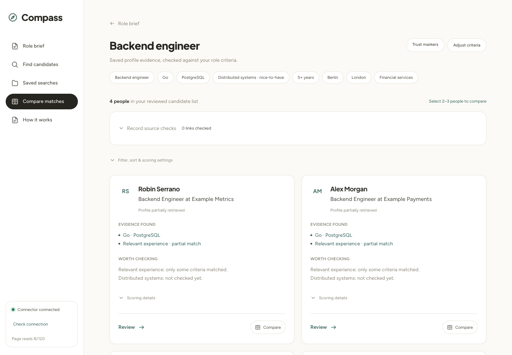
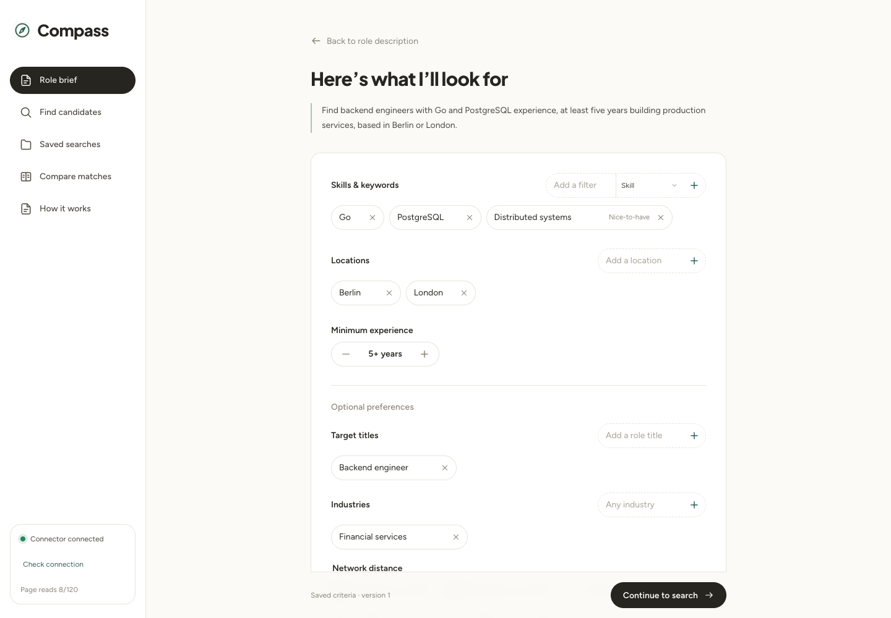
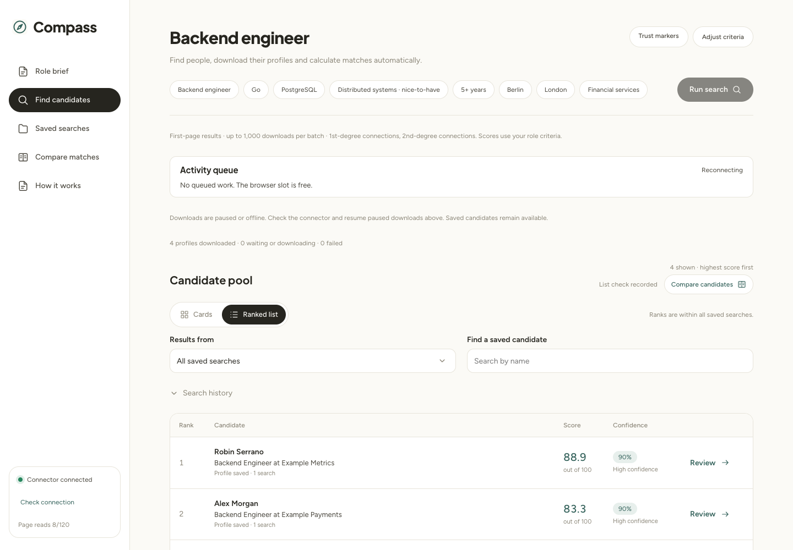
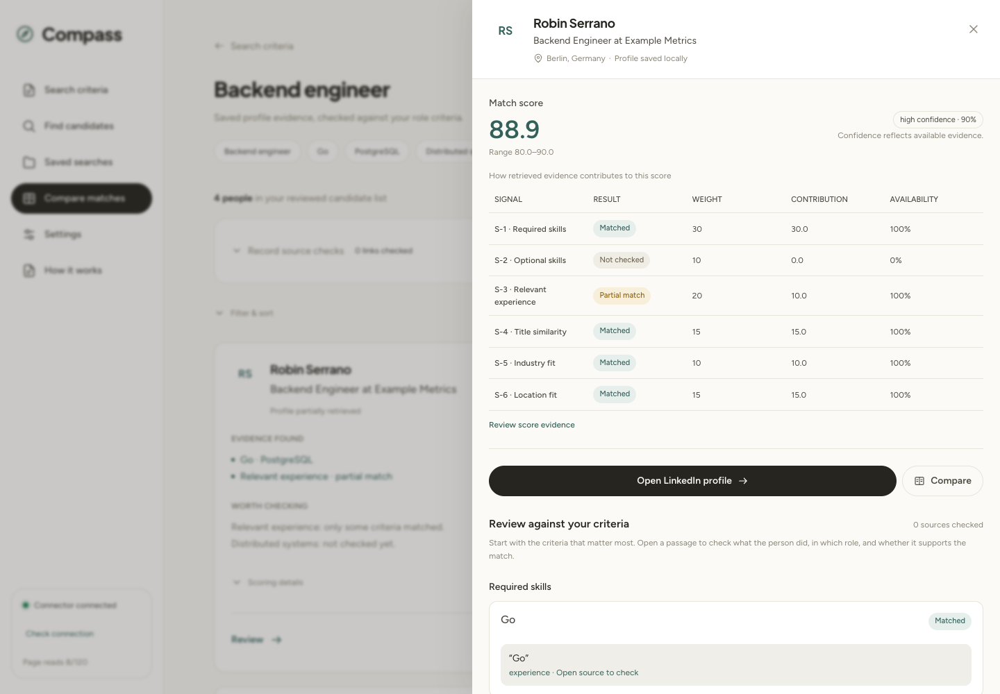
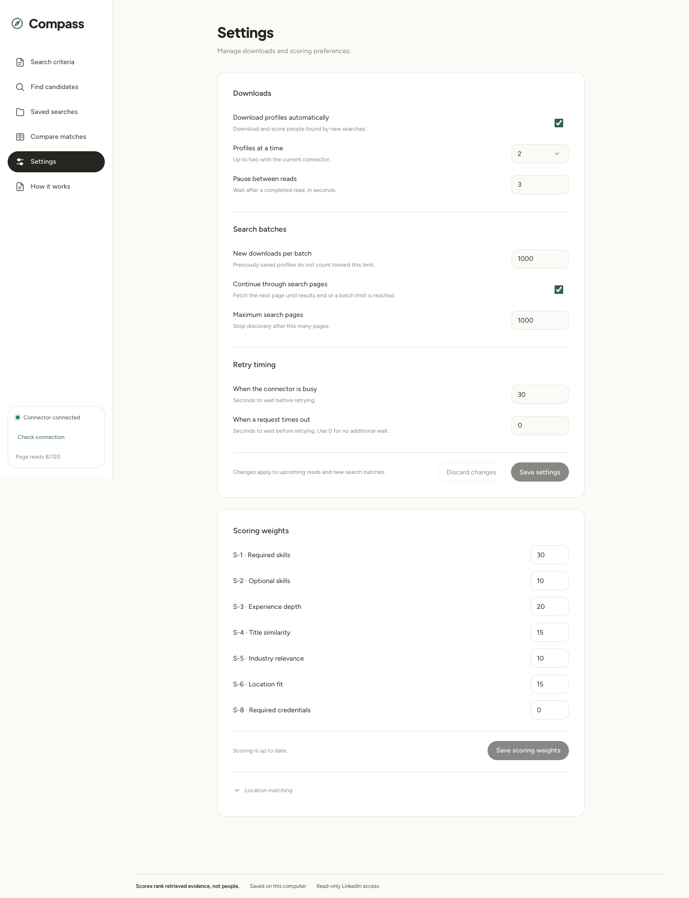
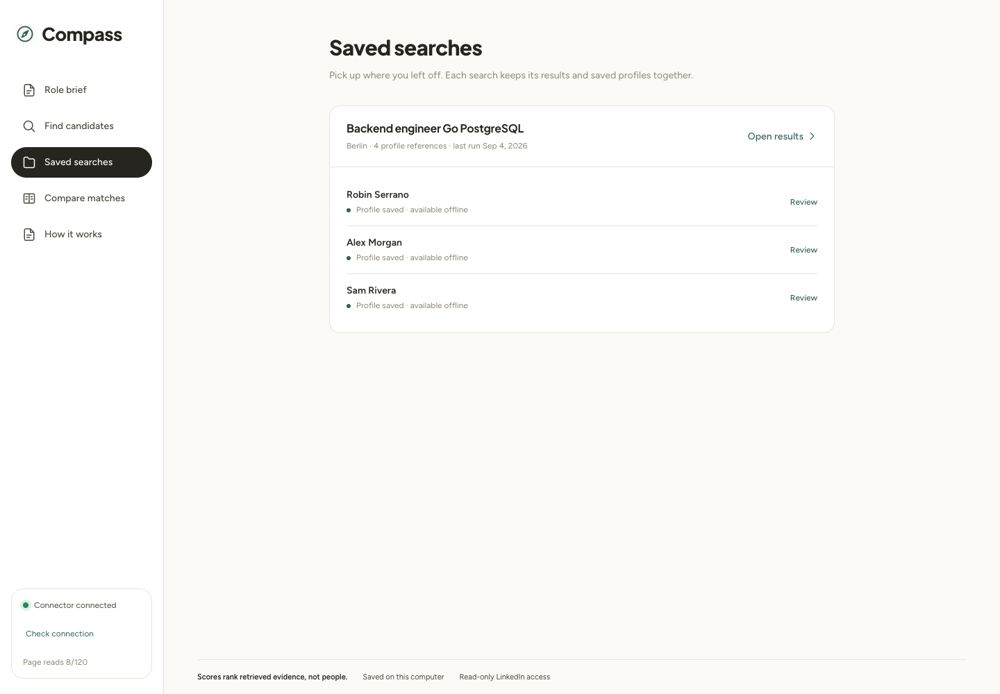
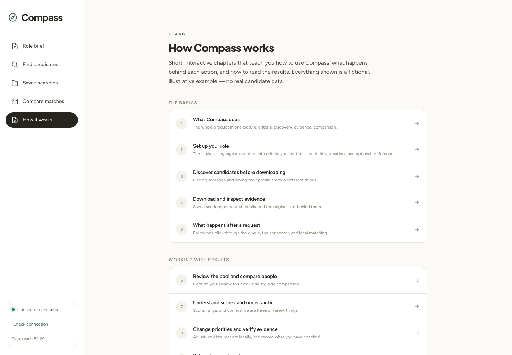

# Compass · LinkedIn Dashboard

A local workspace for finding candidates, saving profile evidence, and comparing
people against a role brief. Compass uses a separately running
[linkedin-mcp-server](https://github.com/stickerdaniel/linkedin-mcp-server) for
on-demand retrieval. Saved profiles, evidence review, and rescoring remain usable
when the connector is offline.



*Screenshots show the actual app with fictional documentation data. They do not
contain real candidate records or represent live search results.*

## Start Compass

Download or clone this repository, open its folder in a terminal, and run:

```sh
./compass
```

Compass prepares its dependencies, opens the app at
[127.0.0.1:8787](http://127.0.0.1:8787/brief), and opens a LinkedIn sign-in window
on first use. Sign in there, set up your role brief in Compass, then choose
**Run search**. Later launches reuse the saved login and installed dependencies.

You do not need to install Python, Node.js, or uv separately, apply connector
patches, or start multiple terminals. The launcher handles those steps. The first
run needs internet access and may take a few minutes. It supports macOS and desktop
Linux with Git and curl installed; Linux also needs Chromium's system libraries.
No administrator privileges are requested by the launcher.

Keep the terminal open while using Compass. **Ctrl+C** stops its services; saved
profiles and searches remain on disk. If sign-in is cancelled, use **Sign in to
LinkedIn** in Compass to try again. To replace an expired login, stop Compass and
run `./compass --login`. Passwords are entered only in LinkedIn's browser window.

The launcher uses a dedicated LinkedIn session under `~/.compass-linkedin/` and
does not import cookies from your everyday browser. Retrieval still opens LinkedIn
pages in that session; it is not a bulk API.

<details>
<summary>Startup options and developer setup</summary>

- `./compass --setup-only` installs dependencies without launching services or login.
- `./compass --no-open` starts Compass and prints its URL without opening the app tab.
- `./compass --port 8788 --connector-port 8001` selects different local ports.
- Startup details are saved in `.compass/connector.log`. If a port is already used,
  stop the previous process or select another port. Compass never kills an unrelated service.

For frontend hot reload, separate processes, and connector maintenance, see the
[development setup](docs/development.md). The normal launcher serves the built
interface from the API, so a separate Vite process is unnecessary.

</details>

## Finding and downloading profiles

By default, **Run search** follows LinkedIn search pages and queues up to **1,000
new profile downloads per batch**. Previously downloaded profiles are reused;
saved candidates can keep accumulating across searches. The limit does not
guarantee LinkedIn will return that many matches.

Choose **1st-degree**, **2nd-degree**, or **3rd-degree and beyond** in Role brief,
or leave all unchecked to search across networks. Network distance does not
contribute to match scores.

Downloads run one or two profiles at a time, depending on Settings and connector
support. Retrieval uses LinkedIn pages in your signed-in browser session; hidden
tabs do not make visits anonymous.

Use **Settings** to change automatic downloads, pacing, and batch limits.
**Stop discovery** stops fetching more search pages; queued downloads continue.
For an older search, select it under **Results from** and choose **Download
remaining profiles**.

## Working with Compass

1. **Role brief** — describe the role, then enter skills and keywords, credentials,
   nice-to-haves, locations, and minimum experience. Target titles, industries,
   network, and company preferences are in the optional section. The description
   is not automatically parsed; review the criteria before continuing.
2. **Find candidates** — run a search from the saved brief. Each location queues
   a separate search. With the default settings, newly found profiles and experience download automatically,
   up to two people at a time, and scoring updates after each download. Repeated results
   reuse saved profiles. The activity summary shows the current task and waiting counts;
   **View tasks** opens ten tasks at a time with individual cancellation controls.
   Keep the current **Cards** view, or switch to
   **Ranked list** after reviewing the list to see rank, score, and confidence.
   Both views show at most 30 profiles per page. Filtering searches the full pool;
   ranked results keep highest-score-first order across pages, with unscored profiles last.
3. **Check the candidate list** — inspect names, LinkedIn links, and repeated
   source searches. Add a note under **What did you check?** and choose
   **Confirm list & show ranking**. You stay in Find candidates, now in Ranked list.
4. **Compare matches** — inspect evidence summaries, select two or three people,
   then choose **View comparison**. **Review** opens the candidate drawer with the
   score first. Under **Review against your criteria**, open a quoted passage to
   read its highlighted saved source. Check whether it supports the criterion, then
   continue to career history and any missing information.
5. **Saved searches** — return to a previous run. Each card previews up to three
   saved profiles; **Open results** opens its full candidate pool.
6. **Settings** — adjust download concurrency, pacing, batch limits, automatic
   retrieval, and retry timing. Save these with **Save settings**. Update signal
   priorities separately with **Save scoring weights**; saved evidence is rescored
   locally. Location equivalences are under **Location matching**.
7. **How it works** — explore interactive examples and guided tours. Exercises
   use fictional data and never modify saved work or send connector requests.

Matching is based on retrieved text and supported aliases. A match is not
independent verification, and missing evidence is not proof that someone lacks a
qualification. **Review score evidence** opens the source checks; opening a source
alone does not mark it verified or change the score. **Record source checks** on
Compare matches is an optional audit record requiring ten distinct current
passages and a note. Unrecorded checks clear on reload or changes to scoring inputs. Network and company search context do not affect
match scores.

### Role brief

Repeated locations, consistent pills, and always-visible optional preferences.



### Ranked list

An additional view in Find candidates, with the same saved-search and name filters.
Ranks stay stable while filtering by name and are scoped to the selected search.



### Candidate review

The score, uncertainty range, confidence, and individual signal results appear
at the top of the review drawer. Detailed verification is available below.



### Settings

Operational controls are separate from role criteria. Scoring weights have their
own save action below the download settings.



<details>
<summary>Saved searches and the interactive guide</summary>

### Saved searches



### How it works



</details>

## Settings and saved data

**Settings** groups download controls and scoring preferences. Scoring weights
have their own save action and recalculate existing evidence locally. Search
criteria, locations, company, and network filters stay in **Role brief**.

Your searches, profiles, and evidence are stored locally in
`~/.linkedin-dashboard/session.db`. Saved work remains available without the
LinkedIn connector while Compass is running. Compass supports research and
comparison; it does not send messages or connection requests.

## More information

- [Settings](docs/settings.md) — download preferences and scoring controls.
- [Usage notes](docs/usage-notes.md) — current limitations and saved-work behavior.
- [Developer guide](docs/development.md) — contributing, setup, tests, and technical documentation.

## Acknowledgments

Thank you to [Daniel Sticker (@stickerdaniel)](https://github.com/stickerdaniel),
the original author of
[linkedin-mcp-server](https://github.com/stickerdaniel/linkedin-mcp-server), and
its contributors for building the open-source LinkedIn connector that makes
Compass possible. Compass connects to that separately running MCP server for
search and profile retrieval.

## License

Compass is licensed under the [MIT License](LICENSE).

The upstream LinkedIn MCP server retains its own
[Apache-2.0 license](https://github.com/stickerdaniel/linkedin-mcp-server/blob/main/LICENSE).
Bundled fonts retain their SIL Open Font Licenses:
[Figtree](frontend/public/fonts/figtree-OFL.txt) and
[Plus Jakarta Sans](frontend/public/fonts/plusjakartasans-OFL.txt).
